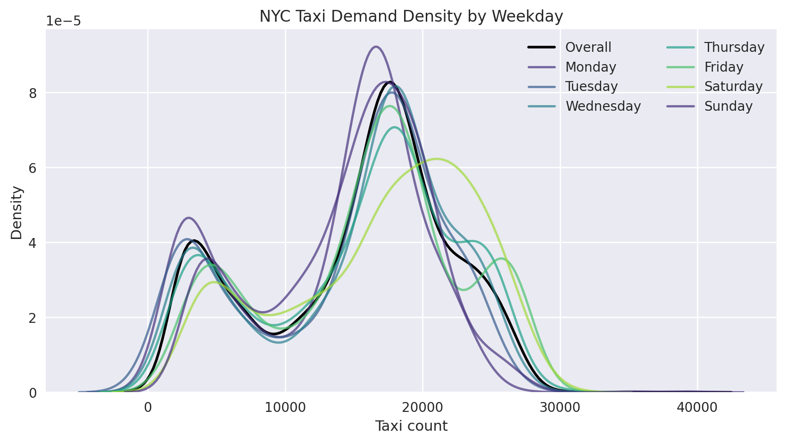
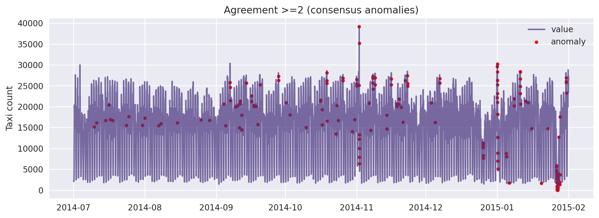

# NYC Taxi Anomaly Exploration

This notebook is my sandbox for poking at the NAB NYC taxi demand series, cleaning it up, and seeing which anomaly detectors actually react to the wild holiday surges New Yorkers know too well.

## 🚀 Overview

The goal is simple: understand how taxi demand behaves hour by hour and confirm whether unsupervised models can pick out the real events (think New Year’s Eve or snowstorms). The notebook walks through light data hygiene, adds temporal context, and then compares several detectors so we can tell which ones latch onto the first/last percentile of demand where true anomalies usually live. Everything runs end-to-end inside `nyc_taxi.ipynb`.

## 🧠 Key Features

- Quick exploratory stats and visuals (KDEs, hourly/daily resamples, weekday heatmaps) to ground intuition before modeling.
- Feature set built around lags, rolling means, and calendar slices, then trimmed with a random forest so we don’t feed noise into the detectors.
- Four complementary anomaly signals—Isolation Forest, cluster distance, One-Class SVM, and a Markov transition score—plus agreement and percentile-tail sanity checks to see how aligned they are with extreme demand.

## 🛠️ Tech Stack

**Python**, **Jupyter**, **NumPy**, **Pandas**, **scikit-learn**, **Matplotlib**, **Seaborn** (no deep learning here; just tried-and-true data-science tools).

## 📊 Results

- Baseline plots surface the weekday/weekend pattern and the late-night surges that dominate the series.
- Each detector gets plotted on top of the raw signal so you can eyeball how often they hit the NAB ground-truth windows.
- An evaluation table summarizes precision/recall/F1, and an agreement plot shows how many models flag the same timestamp.
- The final tail-alignment summary reports how many predictions fall inside the 1st/99th percentile slices—great for verifying we’re catching the obvious extremes.
- Dataset and labels are both pulled straight from the [Numenta Anomaly Benchmark](https://github.com/numenta/NAB).

**Visual highlights**

## 📁 Project Structure

- `nyc_taxi.ipynb` — entire workflow (EDA → features → detectors → evaluation + tails).
- `nyc_taxi.csv` — hourly NYC taxi counts from NAB.
- `combined_labels.json` — matching anomaly windows from NAB.
- `environment.yml` — Conda environment for painless setup.
- `README.md` — you’re reading it.

## ▶️ How to Run

1. `conda env create -f environment.yml && conda activate nyc_taxi` (or install the packages manually if you prefer).
2. Fire up Jupyter (or VS Code notebooks) and open `nyc_taxi.ipynb`.
3. Leave `nyc_taxi.csv` and `combined_labels.json` in the repo root so the notebook can find them.
4. Execute cells from top to bottom; if you tweak model settings, re-run the evaluation and tail-alignment cells at the end to refresh the summaries (and regenerate the PNGs in `figures/` for sharing). Set `SAVE_FIGURES = False` in the first code cell if you want to skip writing images.

